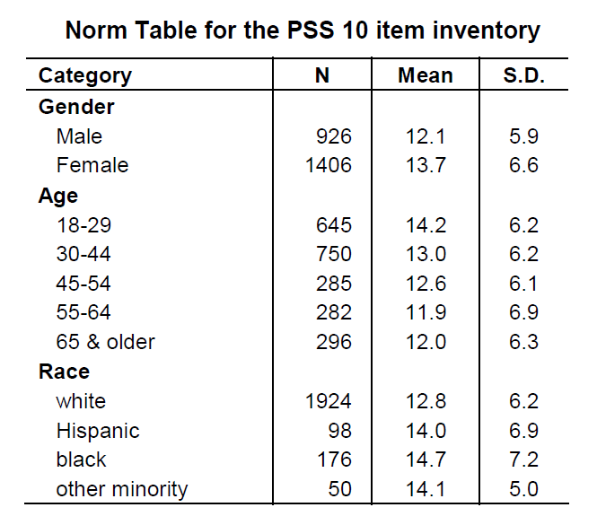

```{r setup, include=FALSE, warning = FALSE, message = FALSE}
knitr::opts_chunk$set(echo = FALSE, warning = FALSE, message = FALSE,
                      fig.align = "center")

#Attach packages
library(tidyverse)
library(here)
library(janitor)
library(kableExtra)
library(patchwork)
library(ggpubr)
```


```{r clean_data}
#Read data and clean variable names
data <- read_csv(here("data", "HAS_demo_clean.csv")) %>% 
  clean_names()

#Select certain columns just for review
data_sub <- data %>% 
  select(subject_id, sex, reproductive_status, age_scan_years,
        bmi, self_ses, education_years, verbal_iq,
        
        #Women's basic repro health
        age_at_menarche_years, time_since_last_cycle_years,
        menopausal_status,
        
        #TH and IP qualtrics
        edinburgh_handedness:ltpa_total,
        
        #Facename
        fname_nt, fname_ot, fname_t)

#Remove men from repo
data_sub_repo <- data_sub %>% 
  filter(reproductive_status != "Men") %>% 
  mutate(reproductive_status = fct_relevel(reproductive_status, 
                                         c("Pre", "Peri", "Post")))
```


```{r add-covid-label}
#Add label to subjects
data_sub <- data_sub %>% 
  mutate(covid_status = case_when(subject_id < 384 ~ "Non-COVID",
                                  subject_id >= 384 ~ "COVID"))

data_sub_repo <- data_sub_repo %>% 
  mutate(covid_status = case_when(subject_id < 384 ~ "Non-COVID",
                                  subject_id >= 384 ~ "COVID"))
```


# Introduction

Data of the *cleaned* sample of Healthy Aging Participants, meaning that these are participants that we have decided to include based on complete fMRI scans, no major health problems from demographic survey, and from previous team discussions of who to exclude as we wrapped up recruitment for the study.

Please refer to hand out for means and standard deviations of the basic demographic and neurpsychological batteries. Figures will only include basic demographic and neurpsychiatric batteries.


# Basic Demographics {.tabset}

Age (years), BMI, highest completed level of education (years), and verbal IQ

**Age:** Ranges from 43-60 years old

**BMI:** Healthy adult BMI levels are about 19-25

**Education:**

- Some College or Associate's = 14 years

- Bachelor's = 16 years

- Master's = 18 years

- Doctoral = 20 years

**Verbal IQ:** Ranges from 74-132 based on AMNART scores


## Reproductive Status


```{r}
#Age
p1 <- ggplot(data = data_sub_repo, aes(y = age_scan_years,
                                 x = reproductive_status,
                                 fill = reproductive_status,
                                 color = reproductive_status)) + 
  geom_boxplot(alpha = 0.5,show.legend = FALSE) +
  geom_jitter(width = 0.1, show.legend = FALSE) +
  stat_summary(fun.y=mean, geom="point",
               shape=20, size=3, color="black", fill="black") +
  labs(x = "Reproductive Status",
       y = "Age (years)",
       title = "Age")


#BMI
p2 <- ggplot(data = data_sub_repo, aes(y = bmi,
                                 x = reproductive_status,
                                 fill = reproductive_status,
                                 color = reproductive_status)) + 
  geom_boxplot(alpha = 0.5,show.legend = FALSE) +
  geom_jitter(width = 0.1, show.legend = FALSE) +
  stat_summary(fun.y=mean, geom="point",
               shape=20, size=3, color="black", fill="black") +
  labs(x = "Reproductive Status",
       y = "BMI",
       title = "BMI")


#Education
p3 <- ggplot(data = data_sub_repo, aes(y = education_years,
                                 x = reproductive_status,
                                 fill = reproductive_status,
                                 color = reproductive_status)) + 
  geom_boxplot(alpha = 0.5,show.legend = FALSE) +
  geom_jitter(width = 0.1, show.legend = FALSE) +
  stat_summary(fun.y=mean, geom="point",
               shape=20, size=3, color="black", fill="black") +
  labs(x = "Reproductive Status",
       y = "Education (years)",
       title = "Education")


#Verbal IQ
p4 <- ggplot(data = data_sub_repo, aes(y = verbal_iq,
                                 x = reproductive_status,
                                 fill = reproductive_status,
                                 color = reproductive_status)) + 
  geom_boxplot(alpha = 0.5,show.legend = FALSE) +
  geom_jitter(width = 0.1, show.legend = FALSE) +
  stat_summary(fun.y=mean, geom="point",
               shape=20, size=3, color="black", fill="black") +
  labs(x = "Reproductive Status",
       y = "Verbal IQ",
       title = "Verbal IQ")

#Combine
(p1+p2)/(p3+p4)
```


## Sex

```{r}
#Age
p1 <- ggplot(data = data_sub, aes(y = age_scan_years,
                                 x = sex,
                                 fill = sex,
                                 color = sex)) + 
  geom_boxplot(alpha = 0.5,show.legend = FALSE) +
  geom_jitter(width = 0.1, show.legend = FALSE) +
  stat_summary(fun.y=mean, geom="point",
               shape=20, size=3, color="black", fill="black") +
  labs(x = "Sex",
       y = "Age (years)",
       title = "Age")


#BMI
p2 <- ggplot(data = data_sub, aes(y = bmi,
                                 x = sex,
                                 fill = sex,
                                 color = sex)) + 
  geom_boxplot(alpha = 0.5,show.legend = FALSE) +
  geom_jitter(width = 0.1, show.legend = FALSE) +
  stat_summary(fun.y=mean, geom="point",
               shape=20, size=3, color="black", fill="black") +
  labs(x = "Sex",
       y = "BMI",
       title = "BMI")


#Education
p3 <- ggplot(data = data_sub, aes(y = education_years,
                                 x = sex,
                                 fill = sex,
                                 color = sex)) + 
  geom_boxplot(alpha = 0.5,show.legend = FALSE) +
  geom_jitter(width = 0.1, show.legend = FALSE) +
  stat_summary(fun.y=mean, geom="point",
               shape=20, size=3, color="black", fill="black") +
  labs(x = "Sex",
       y = "Education (years)",
       title = "Education")


#Verbal IQ
p4 <- ggplot(data = data_sub, aes(y = verbal_iq,
                                 x = sex,
                                 fill = sex,
                                 color = sex)) + 
  geom_boxplot(alpha = 0.5,show.legend = FALSE) +
  geom_jitter(width = 0.1, show.legend = FALSE) +
  stat_summary(fun.y=mean, geom="point",
               shape=20, size=3, color="black", fill="black") +
  labs(x = "Sex",
       y = "Verbal IQ",
       title = "Verbal IQ")

#Combine
(p1+p2)/(p3+p4)
```


## Total

```{r}
#Age
p1 <- ggplot(data = data_sub, aes(x = age_scan_years)) + 
  geom_histogram(alpha = 0.5, position = "identity",
                 show.legend = FALSE) +
  labs(x = "Age (years)",
       y = "Count",
       title = "Age")


#BMI
p2 <- ggplot(data = data_sub, aes(x = bmi)) + 
  geom_histogram(alpha = 0.5, position = "identity",
                 show.legend = FALSE) +
  labs(x = "BMI",
       y = "Count",
       title = "BMI")


#Education
p3 <- ggplot(data = data_sub, aes(x = education_years)) + 
  geom_histogram(alpha = 0.5, position = "identity",
                 show.legend = FALSE) +
  labs(x = "Education (years)",
       y = "Count",
       title = "Education")


#Verbal IQ
p4 <- ggplot(data = data_sub, aes(x = verbal_iq)) + 
  geom_histogram(alpha = 0.5, position = "identity",
                 show.legend = FALSE) +
  labs(x = "Verbal IQ",
       y = "Count",
       title = "Verbal IQ")

#Combine
(p1 + p2)/(p3 + p4)
```


#  {-}

<br>

# Reproductive Health Characteristics {.tabset}

Women only. Includes only age at menarche (years) and time since last menstrual cycle (years).

## Reproductive Status

```{r}
#Age at menarche
p1 <- ggplot(data = data_sub_repo, aes(y = age_at_menarche_years,
                                 x = reproductive_status,
                                 fill = reproductive_status,
                                 color = reproductive_status)) + 
  geom_boxplot(alpha = 0.5,show.legend = FALSE) +
  geom_jitter(width = 0.1, show.legend = FALSE) +
  stat_summary(fun.y=mean, geom="point",
               shape=20, size=3, color="black", fill="black") +
  labs(x = "Reproductive Status",
       y = "Age (years)",
       title = "Age at Menarche")


#Time since last cycle 
p2 <- ggplot(data = data_sub_repo, aes(y = time_since_last_cycle_years,
                                 x = reproductive_status,
                                 fill = reproductive_status,
                                 color = reproductive_status)) + 
  geom_boxplot(alpha = 0.5,show.legend = FALSE) +
  geom_jitter(width = 0.1, show.legend = FALSE) +
  stat_summary(fun.y=mean, geom="point",
               shape=20, size=3, color="black", fill="black") +
  labs(x = "Reproductive Status",
       y = "Time (years)",
       title = "Time Since Last Menstrual Cycle")


#Combine
(p1+p2)
```


## Total

```{r}
#Age at menarche
p1 <- ggplot(data = data_sub, aes(x = age_at_menarche_years)) + 
  geom_histogram(alpha = 0.5, position = "identity",
                 show.legend = FALSE) +
  labs(x = "Age (years)",
       y = "Count",
       title = "Age at Menarche")


#Time since last cycle 
p2 <- ggplot(data = data_sub, aes(x = time_since_last_cycle_years)) + 
  geom_histogram(alpha = 0.5, position = "identity",
                 show.legend = FALSE) +
  labs(x = "Time (years)",
       y = "Count",
       title = "Time Since Last Menstrual Cycle")


#Combine
(p1+p2)
```


#  {-}

<br>

# Neuropsychiatric Assessments {.tabset}


## Edinburgh Handedness 

Meaures handedness (most are right handed)

-	Score of -1.0		= Pure Left Hander

-	Score of -0.5		= Mixed Left Hander

-	Score of 0.0		= Neutral

-	Score of +0.5		= Mixed Right Hander

-	Score of +1.0		= Pure Right Hander

```{r}
#Reproductive status
p1 <- ggplot(data = data_sub_repo, aes(y = edinburgh_handedness,
                                 x = reproductive_status,
                                 fill = reproductive_status,
                                 color = reproductive_status)) + 
  geom_boxplot(alpha = 0.5,show.legend = FALSE) +
  geom_jitter(width = 0.1, show.legend = FALSE) +
  stat_summary(fun.y=mean, geom="point",
               shape=20, size=3, color="black", fill="black") +
  labs(x = "Reproductive Status",
       y = "Handedness",
       title = "Reproductive Status") + 
  theme(legend.position = "none")


#Sex
p2 <- ggplot(data = data_sub, aes(y = edinburgh_handedness,
                                 x = sex,
                                 fill = sex,
                                 color = sex)) + 
  geom_boxplot(alpha = 0.5,show.legend = FALSE) +
  geom_jitter(width = 0.1, show.legend = FALSE) +
  stat_summary(fun.y=mean, geom="point",
               shape=20, size=3, color="black", fill="black") +
  labs(x = "Sex",
       y = "Handedness",
       title = "Sex") + 
  theme(legend.position = "none")


#Total
p3 <- ggplot(data = data_sub, aes(x = edinburgh_handedness)) + 
  geom_histogram(alpha = 0.5, position = "identity",
                 show.legend = FALSE) +
  labs(x = "Handedness",
       y = "Count",
       title = "Total")

#Combine
(p1+p2)/p3
```


## Epworth Sleepiness

Measures whether participant is abnormally sleepy

-	Score of 0-7 = Unlikely to be abnormally sleepy

-	Score of 8-9 = Average amount of daytime sleepiness

-	Score of 10-15 = May be excessively sleepy depending on situation 

-	Score of 16-24 = Excessively sleepy 


```{r}
#Reproductive status
p1 <- ggplot(data = data_sub_repo, aes(y = epworth_sleepiness,
                                 x = reproductive_status,
                                 fill = reproductive_status,
                                 color = reproductive_status)) + 
  geom_boxplot(alpha = 0.5,show.legend = FALSE) +
  geom_jitter(width = 0.1, show.legend = FALSE) +
  stat_summary(fun.y=mean, geom="point",
               shape=20, size=3, color="black", fill="black") +
  labs(x = "Reproductive Status",
       y = "Sleepiness",
       title = "Reproductive Status") + 
  theme(legend.position = "none")


#Sex
p2 <- ggplot(data = data_sub, aes(y = epworth_sleepiness,
                                 x = sex,
                                 fill = sex,
                                 color = sex)) + 
  geom_boxplot(alpha = 0.5,show.legend = FALSE) +
  geom_jitter(width = 0.1, show.legend = FALSE) +
  stat_summary(fun.y=mean, geom="point",
               shape=20, size=3, color="black", fill="black") +
  labs(x = "Sex",
       y = "Sleepiness",
       title = "Sex") + 
  theme(legend.position = "none")


#Total
p3 <- ggplot(data = data_sub, aes(x = epworth_sleepiness)) + 
  geom_histogram(alpha = 0.5, position = "identity",
                 show.legend = FALSE) +
  labs(x = "Sleepiness",
       y = "Count",
       title = "Total")

#Combine
(p1+p2)/p3
```


## Barratt

Measures personality and behavior impulsivity. Higher scores indicate more impulsivity.

**Overall/Total**

```{r}
#Reproductive status
p1 <- ggplot(data = data_sub_repo, aes(y = barratt_total,
                                 x = reproductive_status,
                                 fill = reproductive_status,
                                 color = reproductive_status)) + 
  geom_boxplot(alpha = 0.5,show.legend = FALSE) +
  geom_jitter(width = 0.1, show.legend = FALSE) +
  stat_summary(fun.y=mean, geom="point",
               shape=20, size=3, color="black", fill="black") +
  labs(x = "Reproductive Status",
       y = "Barratt Total",
       title = "Reproductive Status") + 
  theme(legend.position = "none")


#Sex
p2 <- ggplot(data = data_sub, aes(y = barratt_total,
                                 x = sex,
                                 fill = sex,
                                 color = sex)) + 
  geom_boxplot(alpha = 0.5,show.legend = FALSE) +
  geom_jitter(width = 0.1, show.legend = FALSE) +
  stat_summary(fun.y=mean, geom="point",
               shape=20, size=3, color="black", fill="black") +
  labs(x = "Sex",
       y = "Barratt Total",
       title = "Sex") + 
  theme(legend.position = "none")


#Total
p3 <- ggplot(data = data_sub, aes(x = barratt_total)) + 
  geom_histogram(alpha = 0.5, position = "identity",
                 show.legend = FALSE) +
  labs(x = "Barratt Total",
       y = "Count",
       title = "Total")

#Combine
(p1+p2)/p3
```

Barratt questionnaire also breaks down the composite/total score into sub-components. Specific questions are categorized into one of these components:

- **Attention:** attention and cognitive instability

- **Motor:** motor and perseverance

- **Non-Planning:** self-control and cognitive complexity


```{r}
#Average barratt scores 
data_sub_barratt <- data_sub %>% 
  select(sex, reproductive_status, barratt_attention:barratt_total) %>% 
  pivot_longer(cols = c("barratt_attention",
                        "barratt_motor",
                        "barratt_non_planning"),
               names_to = "barratt_type",
               values_to = "score") %>% 
  mutate(barratt_type = recode(barratt_type,
                               barratt_attention = "Attention",
                               barratt_motor = "Motor",
                               barratt_non_planning = "Non-Planning"))

#Mean by sex
data_sub_barratt_mean <- data_sub_barratt %>% 
  group_by(sex, barratt_type) %>% 
  mutate(mean_score = mean(score))


#Mean by repo status
data_sub_barratt_mean_repo <- data_sub_barratt_mean %>% 
  filter(reproductive_status != "Men") %>% 
  mutate(reproductive_status = fct_relevel(reproductive_status, 
                                         c("Pre", "Peri", "Post"))) %>% 
  group_by(reproductive_status, barratt_type) %>% 
  mutate(mean_score = mean(score))
```


```{r barratt-types}
#Reproductive status
p1 <- ggplot(data = data_sub_barratt_mean_repo, aes(y = mean_score,
                                              x = reproductive_status,
                                              group = barratt_type)) + 
  geom_line(aes(color = barratt_type), size = 0.8,
            show.legend = FALSE) +
  geom_point(aes(color = barratt_type), size = 2,
             show.legend = FALSE) +
  labs(x = "Reproductive Status",
       y = "Barratt Score",
       title = "Reproductive Status") 


#Sex
p2 <- ggplot(data = data_sub_barratt_mean, aes(y = mean_score,
                                         x = sex,
                                         group = barratt_type)) + 
  geom_line(aes(color = barratt_type), size = 0.8) +
  geom_point(aes(color = barratt_type), size = 2) +
  labs(x = "Sex",
       y = "Barratt Score",
       title = "Sex") 


#Total
p3 <- ggplot(data = data_sub_barratt, 
       aes(x = score,
           fill = barratt_type,
           color = barratt_type)) + 
  geom_histogram(alpha = 0.5, position = "identity",
                 show.legend = FALSE) +
  labs(x = "Barratt Score",
       y = "Count",
       title = "Total")


#Combine
(p1+p2)/p3
```


## Medical Outcomes

General health index of participants. Scores are the weighted sums of the questions in each section

- Lower scores = more disability

- Higher scores = less disability 

```{r}
#Reproductive status
p1 <- ggplot(data = data_sub_repo, aes(y = medical_outcomes,
                                 x = reproductive_status,
                                 fill = reproductive_status,
                                 color = reproductive_status)) + 
  geom_boxplot(alpha = 0.5,show.legend = FALSE) +
  geom_jitter(width = 0.1, show.legend = FALSE) +
  stat_summary(fun.y=mean, geom="point",
               shape=20, size=3, color="black", fill="black") +
  labs(x = "Reproductive Status",
       y = "Medical Outcomes",
       title = "Reproductive Status") + 
  theme(legend.position = "none")


#Sex
p2 <- ggplot(data = data_sub, aes(y = medical_outcomes,
                                 x = sex,
                                 fill = sex,
                                 color = sex)) + 
  geom_boxplot(alpha = 0.5,show.legend = FALSE) +
  geom_jitter(width = 0.1, show.legend = FALSE) +
  stat_summary(fun.y=mean, geom="point",
               shape=20, size=3, color="black", fill="black") +
  labs(x = "Sex",
       y = "Medical Outcomes",
       title = "Sex") + 
  theme(legend.position = "none")


#Total
p3 <- ggplot(data = data_sub, aes(x = medical_outcomes)) + 
  geom_histogram(alpha = 0.5, position = "identity",
                 show.legend = FALSE) +
  labs(x = "Medical Outcomes",
       y = "Count",
       title = "Total")

#Combine
(p1+p2)/p3
```

Are there possible differences in medical outcomes between subjects recruited before the pandemic versus those who were recruited during? To check, I looked at the data between those who did the study prior to March 2020 (subjects 301-383) and subjects who did the study (subjects 384+) during the pandemic. I also ran a *t*-test to see if there are significant differences between these groups.

```{r}
#Difference by COVID status
ggplot(data = data_sub, aes(y = medical_outcomes,
                            x = covid_status,
                            color = covid_status,
                            fill = covid_status)) +
  geom_boxplot(alpha = 0.5,show.legend = FALSE) +
  geom_jitter(width = 0.1, show.legend = FALSE) +
  stat_summary(fun.y=mean, geom="point",
               shape=20, size=3, color="black", fill="black") +
  labs(x = "COVID Status",
       y = "Medical Outcome")
```

```{r}
#T-test
#t.test(data = data_sub, medical_outcomes ~ covid_status)
```

No difference in medical outcomes between the two groups.

## BAS & BIS 


**Behavioral Avoidance Scale (BAS)** measures motivation to approach goal-oriented outcomes. Statements ranked by participants are categorized into specific motivators for BAS

- Drive

- Fun seeking

- Reward responsiveness

Total is the composite score for BAS, which is the sum of scores from the three subscales

- Higher scores = higher motivation for goal-oriented outcomes


**Overall/Total**

```{r}
#Reproductive status
p1 <- ggplot(data = data_sub_repo, aes(y = bas_total,
                                 x = reproductive_status,
                                 fill = reproductive_status,
                                 color = reproductive_status)) + 
  geom_boxplot(alpha = 0.5,show.legend = FALSE) +
  geom_jitter(width = 0.1, show.legend = FALSE) +
  stat_summary(fun.y=mean, geom="point",
               shape=20, size=3, color="black", fill="black") +
  labs(x = "Reproductive Status",
       y = "BAS Total",
       title = "Reproductive Status") + 
  theme(legend.position = "none")


#Sex
p2 <- ggplot(data = data_sub, aes(y = bas_total,
                                 x = sex,
                                 fill = sex,
                                 color = sex)) + 
  geom_boxplot(alpha = 0.5,show.legend = FALSE) +
  geom_jitter(width = 0.1, show.legend = FALSE) +
  stat_summary(fun.y=mean, geom="point",
               shape=20, size=3, color="black", fill="black") +
  labs(x = "Sex",
       y = "BAS Total",
       title = "Sex") + 
  theme(legend.position = "none")


#Total
p3 <- ggplot(data = data_sub, aes(x = bas_total)) + 
  geom_histogram(alpha = 0.5, position = "identity",
                 show.legend = FALSE) +
  labs(x = "BAS Total",
       y = "Count",
       title = "Total")

#Combine
(p1+p2)/p3
```
We can also view how these subscales differ by reproductive status and sex

```{r}
#Average BAS scores 
data_sub_bas <- data_sub %>% 
  select(sex, reproductive_status, bas_drive:bas_total) %>% 
  pivot_longer(cols = c("bas_drive",
                        "bas_fun_seeking",
                        "bas_reward_responsiveness"),
               names_to = "bas_type",
               values_to = "score") %>% 
  mutate(bas_type = recode(bas_type,
                           bas_drive = "Drive",
                           bas_fun_seeking = "Fun Seeking",
                           bas_reward_responsiveness = "Reward Responsiveness"))

#Mean by sex
data_sub_bas_mean <- data_sub_bas %>% 
  group_by(sex, bas_type) %>% 
  mutate(mean_score = mean(score))


#Mean by repo status
data_sub_bas_mean_repo <- data_sub_bas_mean %>% 
  filter(reproductive_status != "Men") %>% 
  mutate(reproductive_status = fct_relevel(reproductive_status, 
                                         c("Pre", "Peri", "Post"))) %>% 
  group_by(reproductive_status, bas_type) %>% 
  mutate(mean_score = mean(score))
```


```{r bas-types}
#Reproductive status
p1 <- ggplot(data = data_sub_bas_mean_repo, aes(y = mean_score,
                                              x = reproductive_status,
                                              group = bas_type)) + 
  geom_line(aes(color = bas_type), size = 0.8,
            show.legend = FALSE) +
  geom_point(aes(color = bas_type), size = 2,
             show.legend = FALSE) +
  labs(x = "Reproductive Status",
       y = "BAS Score",
       title = "Reproductive Status") 


#Sex
p2 <- ggplot(data = data_sub_bas_mean, aes(y = mean_score,
                                         x = sex,
                                         group = bas_type)) + 
  geom_line(aes(color = bas_type), size = 0.8) +
  geom_point(aes(color = bas_type), size = 2) +
  labs(x = "Sex",
       y = "BAS Score",
       title = "Sex") 


#Total
p3 <- ggplot(data = data_sub_bas, 
       aes(x = score,
           fill = bas_type,
           color = bas_type)) + 
  geom_histogram(alpha = 0.5, position = "identity",
                 show.legend = FALSE) +
  labs(x = "BAS Score",
       y = "Count",
       title = "Total")


#Combine
(p1+p2)/p3
```


**Behavioral Inhibition Scale (BIS)** measures motivation to avoid aversive outcomes

- Higher scores = higher motivation for goal-oriented outcomes

```{r}
#Reproductive status
p1 <- ggplot(data = data_sub_repo, aes(y = bis_total,
                                 x = reproductive_status,
                                 fill = reproductive_status,
                                 color = reproductive_status)) + 
  geom_boxplot(alpha = 0.5,show.legend = FALSE) +
  geom_jitter(width = 0.1, show.legend = FALSE) +
  stat_summary(fun.y=mean, geom="point",
               shape=20, size=3, color="black", fill="black") +
  labs(x = "Reproductive Status",
       y = "BIS Total",
       title = "Reproductive Status") + 
  theme(legend.position = "none")


#Sex
p2 <- ggplot(data = data_sub, aes(y = bis_total,
                                 x = sex,
                                 fill = sex,
                                 color = sex)) + 
  geom_boxplot(alpha = 0.5,show.legend = FALSE) +
  geom_jitter(width = 0.1, show.legend = FALSE) +
  stat_summary(fun.y=mean, geom="point",
               shape=20, size=3, color="black", fill="black") +
  labs(x = "Sex",
       y = "BIS Total",
       title = "Sex") + 
  theme(legend.position = "none")


#Total
p3 <- ggplot(data = data_sub, aes(x = bis_total)) + 
  geom_histogram(alpha = 0.5, position = "identity",
                 show.legend = FALSE) +
  labs(x = "BIS Total",
       y = "Count",
       title = "Total")

#Combine
(p1+p2)/p3
```


## Perceived Stress

Measures participant's perceived stress. There is a potential relationship with perceived stress and health; Cohen et al. (1988) show correlations with PSS and: Stress Measures, Self-Reported Health and Health Services Measures, Health Behavior Measures, Smoking Status, Help Seeking Behavior.

- Higher scores = more perceived stress


```{r fig.align="center", fig.cap="L. Harris Poll gathered information on 2,387 respondents in the U.S. for normative data (from Sheldon Cohen, 1994)"}

```


<br>

```{r}
#Reproductive status
p1 <- ggplot(data = data_sub_repo, aes(y = perceived_stress,
                                 x = reproductive_status,
                                 fill = reproductive_status,
                                 color = reproductive_status)) + 
  geom_boxplot(alpha = 0.5,show.legend = FALSE) +
  geom_jitter(width = 0.1, show.legend = FALSE) +
  stat_summary(fun.y=mean, geom="point",
               shape=20, size=3, color="black", fill="black") +
  labs(x = "Reproductive Status",
       y = "Perceived Stress",
       title = "Reproductive Status") + 
  theme(legend.position = "none")


#Sex
p2 <- ggplot(data = data_sub, aes(y = perceived_stress,
                                 x = sex,
                                 fill = sex,
                                 color = sex)) + 
  geom_boxplot(alpha = 0.5,show.legend = FALSE) +
  geom_jitter(width = 0.1, show.legend = FALSE) +
  stat_summary(fun.y=mean, geom="point",
               shape=20, size=3, color="black", fill="black") +
  labs(x = "Sex",
       y = "Perceived Stress",
       title = "Sex") + 
  theme(legend.position = "none")


#Total
p3 <- ggplot(data = data_sub, aes(x = perceived_stress)) + 
  geom_histogram(alpha = 0.5, position = "identity",
                 show.legend = FALSE) +
  labs(x = "Perceived Stress",
       y = "Count",
       title = "Total")

#Combine
(p1+p2)/p3
```


Because of the possible correlation with health outcomes, I decided to plot perceived stress scores and the medical health outcome scores to see if there is a possible trend

```{r}
#Correlation plot
ggscatter(data = data_sub, x = "medical_outcomes", y = "perceived_stress",
          add = "reg.line",
          add.params = list(color = "blue", fill = "lightgray"), # Customize reg. line
          cor.coef = TRUE, # Add correlation coefficient. see ?stat_cor
          conf.int = TRUE,
          cor.method = "pearson",
          cor.coeff.args = list(label.sep = "\n"),
          xlab = "Medical Outcomes", ylab = "Perceived Stress")
```

Less disability (higher medical outcomes score) is associated with less perceived stress.


```{r}
#Reproductive status
p1 <- ggplot(data = data_sub_repo, aes(x = medical_outcomes,
                                       y = perceived_stress,
                                       color = reproductive_status)) +
  geom_point(aes(color = reproductive_status),
             size = 2, alpha = 0.8) +
  geom_smooth(method = lm) +
  labs(x = "Medical Outcomes",
       y = "Perceived Stress",
       color = "Reproductive Status",
       title = "Reproductive Status") +
  theme_minimal() +
  theme(legend.position = "top")


#Sex
p2 <- ggplot(data = data_sub, aes(x = medical_outcomes,
                                 y = perceived_stress,
                                 color = sex)) +
  geom_point(aes(color = sex),
             size = 2, alpha = 0.8) +
  geom_smooth(method = lm) +
  labs(x = "Medical Outcomes",
       y = "Perceived Stress",
       color = "Sex",
       title = "Sex") +
  theme_minimal() +
  theme(legend.position = "top")


#Combine
p1+p2
```

Is there more perceived stress for participants due to the pandemic? I explore whether participants feel more stressed when recruited during the pandemic.

```{r}
#Table
# data_sub %>% group_by(covid_status) %>% 
#   summarize(sample = n(),
#             mean = mean(perceived_stress),
#             sd = sd(perceived_stress))
```


```{r}
#Difference by COVID status
ggplot(data = data_sub, aes(y = perceived_stress,
                            x = covid_status,
                            color = covid_status,
                            fill = covid_status)) +
  geom_boxplot(alpha = 0.5,show.legend = FALSE) +
  geom_jitter(width = 0.1, show.legend = FALSE) +
  stat_summary(fun.y=mean, geom="point",
               shape=20, size=3, color="black", fill="black") +
  labs(x = "COVID Status",
       y = "Perceived Stress")
```

```{r}
#T-test
#t.test(data = data_sub, perceived_stress ~ covid_status)
```

No differences in perceived stress between "COVID" and "Non-COVID" groups.

## SSS Community Ladder

Measures the participant’s perceived social standing within their community. Scores range from 1-10.

- Higher scores = more perceived social standing


```{r}
#Reproductive status
p1 <- ggplot(data = data_sub_repo, aes(y = sss_community_ladder,
                                 x = reproductive_status,
                                 fill = reproductive_status,
                                 color = reproductive_status)) + 
  geom_boxplot(alpha = 0.5,show.legend = FALSE) +
  geom_jitter(width = 0.1, show.legend = FALSE) +
  stat_summary(fun.y=mean, geom="point",
               shape=20, size=3, color="black", fill="black") +
  labs(x = "Reproductive Status",
       y = "Social Standing",
       title = "Reproductive Status") + 
  theme(legend.position = "none")


#Sex
p2 <- ggplot(data = data_sub, aes(y = sss_community_ladder,
                                 x = sex,
                                 fill = sex,
                                 color = sex)) + 
  geom_boxplot(alpha = 0.5,show.legend = FALSE) +
  geom_jitter(width = 0.1, show.legend = FALSE) +
  stat_summary(fun.y=mean, geom="point",
               shape=20, size=3, color="black", fill="black") +
  labs(x = "Sex",
       y = "Social Standing",
       title = "Sex") + 
  theme(legend.position = "none")


#Total
p3 <- ggplot(data = data_sub, aes(x = sss_community_ladder)) + 
  geom_histogram(alpha = 0.5, position = "identity",
                 show.legend = FALSE) +
  labs(x = "Social Standing",
       y = "Count",
       title = "Total")

#Combine
(p1+p2)/p3
```


## SSS US Ladder

Measures the participant’s perceived social standing within the United States. Scores range from 1-10.

- Higher scores = more perceived social standing


```{r}
#Reproductive status
p1 <- ggplot(data = data_sub_repo, aes(y = sss_us_ladder,
                                 x = reproductive_status,
                                 fill = reproductive_status,
                                 color = reproductive_status)) + 
  geom_boxplot(alpha = 0.5,show.legend = FALSE) +
  geom_jitter(width = 0.1, show.legend = FALSE) +
  stat_summary(fun.y=mean, geom="point",
               shape=20, size=3, color="black", fill="black") +
  labs(x = "Reproductive Status",
       y = "Social Standing",
       title = "Reproductive Status") + 
  theme(legend.position = "none")


#Sex
p2 <- ggplot(data = data_sub, aes(y = sss_us_ladder,
                                 x = sex,
                                 fill = sex,
                                 color = sex)) + 
  geom_boxplot(alpha = 0.5,show.legend = FALSE) +
  geom_jitter(width = 0.1, show.legend = FALSE) +
  stat_summary(fun.y=mean, geom="point",
               shape=20, size=3, color="black", fill="black") +
  labs(x = "Sex",
       y = "Social Standing",
       title = "Sex") + 
  theme(legend.position = "none")


#Total
p3 <- ggplot(data = data_sub, aes(x = sss_us_ladder)) + 
  geom_histogram(alpha = 0.5, position = "identity",
                 show.legend = FALSE) +
  labs(x = "Social Standing",
       y = "Count",
       title = "Total")

#Combine
(p1+p2)/p3
```


## Geriatric Depression

Measures participant depression

- Scores ranging 0-5 are considered normal

- Scores that are 5+ suggest depression

```{r}
#Reproductive status
p1 <- ggplot(data = data_sub_repo, aes(y = geriatric_depression,
                                 x = reproductive_status,
                                 fill = reproductive_status,
                                 color = reproductive_status)) + 
  geom_boxplot(alpha = 0.5,show.legend = FALSE) +
  geom_jitter(width = 0.1, show.legend = FALSE) +
  stat_summary(fun.y=mean, geom="point",
               shape=20, size=3, color="black", fill="black") +
  labs(x = "Reproductive Status",
       y = "Geriatric Depression",
       title = "Reproductive Status") + 
  theme(legend.position = "none")


#Sex
p2 <- ggplot(data = data_sub, aes(y = geriatric_depression,
                                 x = sex,
                                 fill = sex,
                                 color = sex)) + 
  geom_boxplot(alpha = 0.5,show.legend = FALSE) +
  geom_jitter(width = 0.1, show.legend = FALSE) +
  stat_summary(fun.y=mean, geom="point",
               shape=20, size=3, color="black", fill="black") +
  labs(x = "Sex",
       y = "Geriatric Depression",
       title = "Sex") + 
  theme(legend.position = "none")


#Total
p3 <- ggplot(data = data_sub, aes(x = geriatric_depression)) + 
  geom_histogram(alpha = 0.5, position = "identity",
                 show.legend = FALSE) +
  labs(x = "Geriatric Depression",
       y = "Count",
       title = "Total")

#Combine
(p1+p2)/p3
```


There are plenty of participants whose scores were 5+, but may be due to COVID depression. 

```{r}
#Table
# data_sub %>% group_by(covid_status) %>% 
#   summarize(sample = n(),
#             mean = mean(geriatric_depression),
#             sd = sd(geriatric_depression))
```


```{r}
#Difference by COVID status
ggplot(data = data_sub, aes(y = geriatric_depression,
                            x = covid_status,
                            color = covid_status,
                            fill = covid_status)) +
  geom_boxplot(alpha = 0.5,show.legend = FALSE) +
  geom_jitter(width = 0.1, show.legend = FALSE) +
  stat_summary(fun.y=mean, geom="point",
               shape=20, size=3, color="black", fill="black") +
  labs(x = "COVID Status",
       y = "Geriatric Depression")
```

```{r}
#T-test
#t.test(data = data_sub, geriatric_depression ~ covid_status)
```
No differencs between the two groups.

Scale was developed by Sheikh & Yesavage, 1986. Times are a lot different now and there is lots to be sad about (i.e., general depression is normalized)


## PSQI

Pittsburgh Sleep Quality Index. Measures quality of sleep by taking into account 7 components: habitual sleep efficiency, subjective sleep quality, sleep duration, sleep latency, use of sleep medications, sleep disturbances, and daytime dysfunction.

Each component is given a score from 0-3, with 0 meaning no difficulty and 3 meaning having severe difficulty.

The PSQI score thus ranges from 0-21:

- Scores of 0 = No difficulty sleeping

- Score of 21 = Severe difficulties in all components/areas


```{r}
#Reproductive status
p1 <- ggplot(data = data_sub_repo, aes(y = psqi,
                                 x = reproductive_status,
                                 fill = reproductive_status,
                                 color = reproductive_status)) + 
  geom_boxplot(alpha = 0.5,show.legend = FALSE) +
  geom_jitter(width = 0.1, show.legend = FALSE) +
  stat_summary(fun.y=mean, geom="point",
               shape=20, size=3, color="black", fill="black") +
  labs(x = "Reproductive Status",
       y = "PSQI Score",
       title = "Reproductive Status") + 
  theme(legend.position = "none")


#Sex
p2 <- ggplot(data = data_sub, aes(y = psqi,
                                 x = sex,
                                 fill = sex,
                                 color = sex)) + 
  geom_boxplot(alpha = 0.5,show.legend = FALSE) +
  geom_jitter(width = 0.1, show.legend = FALSE) +
  stat_summary(fun.y=mean, geom="point",
               shape=20, size=3, color="black", fill="black") +
  labs(x = "Sex",
       y = "PSQI Score",
       title = "Sex") + 
  theme(legend.position = "none")


#Total
p3 <- ggplot(data = data_sub, aes(x = psqi)) + 
  geom_histogram(alpha = 0.5, position = "identity",
                 show.legend = FALSE) +
  labs(x = "PSQI Score",
       y = "Count",
       title = "Total")

#Combine
(p1+p2)/p3
```


## LCA Total

Lifetime Cognitive Activity (LCA) measures participant’s cognitive enrichment through activities they have experienced overall

Includes scores from ages 6, 12, 18, and present

```{r}
#Reproductive status
p1 <- ggplot(data = data_sub_repo, aes(y = lca_total,
                                 x = reproductive_status,
                                 fill = reproductive_status,
                                 color = reproductive_status)) + 
  geom_boxplot(alpha = 0.5,show.legend = FALSE) +
  geom_jitter(width = 0.1, show.legend = FALSE) +
  stat_summary(fun.y=mean, geom="point",
               shape=20, size=3, color="black", fill="black") +
  labs(x = "Reproductive Status",
       y = "LCA Total",
       title = "Reproductive Status") + 
  theme(legend.position = "none")


#Sex
p2 <- ggplot(data = data_sub, aes(y = lca_total,
                                 x = sex,
                                 fill = sex,
                                 color = sex)) + 
  geom_boxplot(alpha = 0.5,show.legend = FALSE) +
  geom_jitter(width = 0.1, show.legend = FALSE) +
  stat_summary(fun.y=mean, geom="point",
               shape=20, size=3, color="black", fill="black") +
  labs(x = "Sex",
       y = "LCA Total",
       title = "Sex") + 
  theme(legend.position = "none")


#Total
p3 <- ggplot(data = data_sub, aes(x = lca_total)) + 
  geom_histogram(alpha = 0.5, position = "identity",
                 show.legend = FALSE) +
  labs(x = "LCA Total",
       y = "Count",
       title = "Total")

#Combine
(p1+p2)/p3
```

We ask participants in general, all else being same, how often they would do certain activities. Some may have thought about the present time and activities they can't do during the pandemic, such as going to museums. I also checked whether there are differences between particants recruited pre- and during pandemic.


```{r}
#Difference by COVID status: present
p1 <- ggplot(data = data_sub, aes(y = lca_present,
                            x = covid_status,
                            color = covid_status,
                            fill = covid_status)) +
  geom_boxplot(alpha = 0.5,show.legend = FALSE) +
  geom_jitter(width = 0.1, show.legend = FALSE) +
  stat_summary(fun.y=mean, geom="point",
               shape=20, size=3, color="black", fill="black") +
  labs(x = "COVID Status",
       y = "LCA Present")


#Difference by COVID status: total
p2 <- ggplot(data = data_sub, aes(y = lca_total,
                            x = covid_status,
                            color = covid_status,
                            fill = covid_status)) +
  geom_boxplot(alpha = 0.5,show.legend = FALSE) +
  geom_jitter(width = 0.1, show.legend = FALSE) +
  stat_summary(fun.y=mean, geom="point",
               shape=20, size=3, color="black", fill="black") +
  labs(x = "COVID Status",
       y = "LCA Total")

#Combine
p1+p2
```
For both present and total LTPA, there appears to be no major differences based on exploratory tests.

```{r}
# t.test(data = data_sub, lca_present ~ covid_status)
# t.test(data = data_sub, lca_total ~ covid_status)
```


## LTPA Total

Leisure Time Physical Activity (LTPA) measures participant’s intensity and frequency of physical activity based on rate of energy expenditure. Participants rate activities they have participated in the last 12 months at the time they take the survey. Activities have been categorized as light, moderate, or heavy.

Activity Metabolic Index (AMI) scores are duration of time participant spend on activity multiplied by the metabolic equivalent (MET) intensity code of the specific activity. The total LTPA is a sum of the AMI scores from light, moderate, and physical activities.


```{r}
#Reproductive status
p1 <- ggplot(data = data_sub_repo, aes(y = ltpa_total,
                                 x = reproductive_status,
                                 fill = reproductive_status,
                                 color = reproductive_status)) + 
  geom_boxplot(alpha = 0.5,show.legend = FALSE) +
  geom_jitter(width = 0.1, show.legend = FALSE) +
  stat_summary(fun.y=mean, geom="point",
               shape=20, size=3, color="black", fill="black") +
  labs(x = "Reproductive Status",
       y = "LTPA Total",
       title = "Reproductive Status") + 
  theme(legend.position = "none")


#Sex
p2 <- ggplot(data = data_sub, aes(y = ltpa_total,
                                 x = sex,
                                 fill = sex,
                                 color = sex)) + 
  geom_boxplot(alpha = 0.5,show.legend = FALSE) +
  geom_jitter(width = 0.1, show.legend = FALSE) +
  stat_summary(fun.y=mean, geom="point",
               shape=20, size=3, color="black", fill="black") +
  labs(x = "Sex",
       y = "LTPA Total",
       title = "Sex") + 
  theme(legend.position = "none")


#Total
p3 <- ggplot(data = data_sub, aes(x = ltpa_total)) + 
  geom_histogram(alpha = 0.5, position = "identity",
                 show.legend = FALSE) +
  labs(x = "LTPA Total",
       y = "Count",
       title = "Total")

#Combine
(p1+p2)/p3
```
Given that this asks participants' physical activity in just the last 12 months, COVID may have changed how often they go outside or change their exercise habits. I explore whethere there is a difference in total LTPA scores between participants who were in the study pre-pandemic and those who were recruited during the pandemic.

```{r}
#Difference by COVID status: total
ggplot(data = data_sub, aes(y = ltpa_total,
                            x = covid_status,
                            color = covid_status,
                            fill = covid_status)) +
  geom_boxplot(alpha = 0.5,show.legend = FALSE) +
  geom_jitter(width = 0.1, show.legend = FALSE) +
  stat_summary(fun.y=mean, geom="point",
               shape=20, size=3, color="black", fill="black") +
  labs(x = "COVID Status",
       y = "LTPA Total")
```

```{r}
#T-test
#t.test(data = data_sub, ltpa_total ~ covid_status)
```
There is no difference in physical activity between subjects recruited pre-pandemic and during pandemic.


## POMS


Profile of Mood States (POMS) measures participant’s current feelings or transient, direct mood states

Participants rate how much they agree with feeling certain moods currently, and moods are categorized as the following with range of scores:

- **Tension:** 9-45

- **Depression:** 15-75

- **Anger:** 12-60

-	**Fatigue:** 7-35

-	**Confusion:** 7-35

- **Vigour:** 8-40

- **TMD:** 10-242

TMD is Total Mood Disturbance, which is the composite score for POMS

**Overall/Total**

```{r}
#Reproductive status
p1 <- ggplot(data = data_sub_repo, aes(y = poms_tmd,
                                 x = reproductive_status,
                                 fill = reproductive_status,
                                 color = reproductive_status)) + 
  geom_boxplot(alpha = 0.5,show.legend = FALSE) +
  geom_jitter(width = 0.1, show.legend = FALSE) +
  stat_summary(fun.y=mean, geom="point",
               shape=20, size=3, color="black", fill="black") +
  labs(x = "Reproductive Status",
       y = "POMS Total",
       title = "Reproductive Status") + 
  theme(legend.position = "none")


#Sex
p2 <- ggplot(data = data_sub, aes(y = poms_tmd,
                                 x = sex,
                                 fill = sex,
                                 color = sex)) + 
  geom_boxplot(alpha = 0.5,show.legend = FALSE) +
  geom_jitter(width = 0.1, show.legend = FALSE) +
  stat_summary(fun.y=mean, geom="point",
               shape=20, size=3, color="black", fill="black") +
  labs(x = "Sex",
       y = "POMS Total",
       title = "Sex") + 
  theme(legend.position = "none")


#Total
p3 <- ggplot(data = data_sub, aes(x = poms_tmd)) + 
  geom_histogram(alpha = 0.5, position = "identity",
                 show.legend = FALSE) +
  labs(x = "POMS Total",
       y = "Count",
       title = "Total")

#Combine
(p1+p2)/p3
```

We can also look at the other components of POMS

```{r}
#Average poms scores 
data_sub_poms <- data_sub %>% 
  select(sex, reproductive_status, poms_tension:poms_tmd) %>% 
  pivot_longer(cols = c("poms_tension",
                        "poms_depression",
                        "poms_anger",
                        "poms_fatigue",
                        "poms_confusion",
                        "poms_vigour"),
               names_to = "poms_type",
               values_to = "score") %>% 
  mutate(poms_type = recode(poms_type,
                            poms_tension = "Tension",
                            poms_depression = "Depression",
                            poms_anger = "Anger",
                            poms_fatigue = "Fatigue",
                            poms_confusion = "Confusion",
                            poms_vigour = "Vigour"))

#Mean by sex
data_sub_poms_mean <- data_sub_poms %>% 
  group_by(sex, poms_type) %>% 
  mutate(mean_score = mean(score))


#Mean by repo status
data_sub_poms_mean_repo <- data_sub_poms_mean %>% 
  filter(reproductive_status != "Men") %>% 
  mutate(reproductive_status = fct_relevel(reproductive_status, 
                                         c("Pre", "Peri", "Post"))) %>% 
  group_by(reproductive_status, poms_type) %>% 
  mutate(mean_score = mean(score))
```


```{r poms-types}
#Reproductive status
p1 <- ggplot(data = data_sub_poms_mean_repo, aes(y = mean_score,
                                              x = reproductive_status,
                                              group = poms_type)) + 
  geom_line(aes(color = poms_type), size = 0.8,
            show.legend = FALSE) +
  geom_point(aes(color = poms_type), size = 2,
             show.legend = FALSE) +
  labs(x = "Reproductive Status",
       y = "POMS Score",
       title = "Reproductive Status") 


#Sex
#Repoductive status
p2 <- ggplot(data = data_sub_poms_mean, aes(y = mean_score,
                                         x = sex,
                                         group = poms_type)) + 
  geom_line(aes(color = poms_type), size = 0.8) +
  geom_point(aes(color = poms_type), size = 2) +
  labs(x = "Sex",
       y = "POMS Score",
       title = "Sex") 


#Total
p3 <- ggplot(data = data_sub_poms, 
       aes(x = score,
           fill = poms_type,
           color = poms_type)) + 
  geom_histogram(alpha = 0.5, position = "identity",
                 show.legend = FALSE) +
  labs(x = "POMS Score",
       y = "Count",
       title = "Total")


#Combine
(p1+p2)/p3
```

## STAI

State-Trait Inventory for Adults (STAI) measures participant’s anxiety

**STATE:** current level of anxiety


```{r stai-state}
#Reproductive status
p1 <- ggplot(data = data_sub_repo, aes(y = stai_state,
                                 x = reproductive_status,
                                 fill = reproductive_status,
                                 color = reproductive_status)) + 
  geom_boxplot(alpha = 0.5,show.legend = FALSE) +
  geom_jitter(width = 0.1, show.legend = FALSE) +
  stat_summary(fun.y=mean, geom="point",
               shape=20, size=3, color="black", fill="black") +
  labs(x = "Reproductive Status",
       y = "Current Anxiety Level",
       title = "Reproductive Status") + 
  theme(legend.position = "none")


#Sex
p2 <- ggplot(data = data_sub, aes(y = stai_state,
                                 x = sex,
                                 fill = sex,
                                 color = sex)) + 
  geom_boxplot(alpha = 0.5,show.legend = FALSE) +
  geom_jitter(width = 0.1, show.legend = FALSE) +
  stat_summary(fun.y=mean, geom="point",
               shape=20, size=3, color="black", fill="black") +
  labs(x = "Sex",
       y = "Current Anxiety Level",
       title = "Sex") + 
  theme(legend.position = "none")


#Total
p3 <- ggplot(data = data_sub, aes(x = stai_state)) + 
  geom_histogram(alpha = 0.5, position = "identity",
                 show.legend = FALSE) +
  labs(x = "Current Anxiety Level",
       y = "Count",
       title = "Total")

#Combine
(p1+p2)/p3
```

**TRAIT:** general level of anxiety

```{r stai-trait}
#Reproductive status
p1 <- ggplot(data = data_sub_repo, aes(y = stai_trait,
                                 x = reproductive_status,
                                 fill = reproductive_status,
                                 color = reproductive_status)) + 
  geom_boxplot(alpha = 0.5,show.legend = FALSE) +
  geom_jitter(width = 0.1, show.legend = FALSE) +
  stat_summary(fun.y=mean, geom="point",
               shape=20, size=3, color="black", fill="black") +
  labs(x = "Reproductive Status",
       y = "General Anxiety Level",
       title = "Reproductive Status") + 
  theme(legend.position = "none")


#Sex
p2 <- ggplot(data = data_sub, aes(y = stai_trait,
                                 x = sex,
                                 fill = sex,
                                 color = sex)) + 
  geom_boxplot(alpha = 0.5,show.legend = FALSE) +
  geom_jitter(width = 0.1, show.legend = FALSE) +
  stat_summary(fun.y=mean, geom="point",
               shape=20, size=3, color="black", fill="black") +
  labs(x = "Sex",
       y = "General Anxiety Level",
       title = "Sex") + 
  theme(legend.position = "none")


#Total
p3 <- ggplot(data = data_sub, aes(x = stai_trait)) + 
  geom_histogram(alpha = 0.5, position = "identity",
                 show.legend = FALSE) +
  labs(x = "General Anxiety Level",
       y = "Count",
       title = "Total")

#Combine
(p1+p2)/p3
```

Generally, anxiety levels seem higher. Will COVID also influence current and general forms of anxiety?

```{r}
#Difference by COVID status: STATE
p1 <- ggplot(data = data_sub, aes(y = stai_state,
                            x = covid_status,
                            color = covid_status,
                            fill = covid_status)) +
  geom_boxplot(alpha = 0.5,show.legend = FALSE) +
  geom_jitter(width = 0.1, show.legend = FALSE) +
  stat_summary(fun.y=mean, geom="point",
               shape=20, size=3, color="black", fill="black") +
  labs(x = "COVID Status",
       y = "Current Anxiety Level",
       title = "STATE")


#Difference by COVID status: STATE
p2 <- ggplot(data = data_sub, aes(y = stai_trait,
                            x = covid_status,
                            color = covid_status,
                            fill = covid_status)) +
  geom_boxplot(alpha = 0.5,show.legend = FALSE) +
  geom_jitter(width = 0.1, show.legend = FALSE) +
  stat_summary(fun.y=mean, geom="point",
               shape=20, size=3, color="black", fill="black") +
  labs(x = "COVID Status",
       y = "General Anxiety Level",
       title = "TRAIT")


#Combine
p1+p2
```
```{r}
#T-test
# t.test(data = data_sub, stai_state ~ covid_status)
# t.test(data = data_sub, stai_trait ~ covid_status)
```
No differences for either STATE or TRAIT between groups.

# {-}

<br>

# Face Name {.tabset}

## Name Learning and Retrieval


## Ocupation Learning and Retrieval


## Composite Name and Occupation

# {-}


