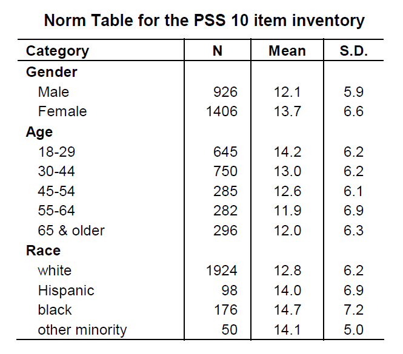

```{r setup, include=FALSE, warning = FALSE, message = FALSE}
knitr::opts_chunk$set(echo = FALSE, warning = FALSE, message = FALSE,
                      fig.align = "center")

#Attach packages
library(tidyverse)
library(here)
library(janitor)
library(kableExtra)
library(patchwork)
library(ggpubr)
library(RColorBrewer)
```


```{r clean_data}

########## ALL
data_all <- read_csv(here("data", "HAS_demo_all.csv")) %>% 
  clean_names()


########## CLEAN

#Read data and clean variable names
data <- read_csv(here("data", "HAS_demo_clean.csv")) %>% 
  clean_names()

#Select certain columns just for review
data_sub <- data %>% 
  select(subject_id, sex, reproductive_status, age_scan_years,
        bmi, self_ses, education_years, verbal_iq,
        
        #Women's basic repro health
        age_at_menarche_years, time_since_last_cycle_years,
        menopausal_status,
        
        #TH and IP qualtrics
        edinburgh_handedness:ltpa_total,
        
        #Facename
        fname_nt, fname_ot, fname_t)

#Remove men from repo
data_sub_repo <- data_sub %>% 
  filter(reproductive_status != "Men") %>% 
  mutate(reproductive_status = fct_relevel(reproductive_status, 
                                         c("Pre", "Peri", "Post")))
```


# Introduction

Data of the *cleaned* sample of Healthy Aging Participants, meaning that these are participants that we have decided to include based on complete fMRI scans, no major health problems from demographic survey, and from previous team discussions of who to exclude as we wrapped up recruitment for the study.

Subjects ranged from 301-437, scanned over the course of March 1, 2017 to February 10, 2022.

Black diamond point are the group means. Highlighted in purple triangle point and purple line is subject 438.


Please refer to hand out for means and standard deviations of the basic demographic and neurpsychological batteries. Figures will only include basic demographic and neurpsychiatric batteries.


# Basic Demographics {.tabset}

Age (years), BMI, highest completed level of education (years), and verbal IQ

**Age:** Ranges from 43-60 years old

**BMI:** Healthy adult BMI levels are about 19-25

**Education:**

- Some College or Associate's = 14 years

- Bachelor's = 16 years

- Master's = 18 years

- Doctoral = 20 years

**Verbal IQ:** Ranges from 74-132 based on AMNART scores


## Reproductive Status


```{r}
#Age
p1 <- ggplot(data = data_sub_repo, aes(y = age_scan_years,
                                 x = reproductive_status,
                                 fill = reproductive_status,
                                 color = reproductive_status)) + 
  geom_boxplot(alpha = 0.5,show.legend = FALSE) +
  geom_jitter(width = 0.1, show.legend = FALSE) +
  stat_summary(fun.y=mean, geom="point",
               shape=20, size=3, color="black", fill="black") +
  labs(x = "Reproductive Status",
       y = "Age (years)",
       title = "Age") +
  
  #Add 438
  geom_point(aes(x = factor("Post"), y=64),
             color = "purple", shape = 17, size = 3,
             show.legend = FALSE)


#BMI
p2 <- ggplot(data = data_sub_repo, aes(y = bmi,
                                 x = reproductive_status,
                                 fill = reproductive_status,
                                 color = reproductive_status)) + 
  geom_boxplot(alpha = 0.5,show.legend = FALSE) +
  geom_jitter(width = 0.1, show.legend = FALSE) +
  stat_summary(fun.y=mean, geom="point",
               shape=20, size=3, color="black", fill="black") +
  labs(x = "Reproductive Status",
       y = "BMI",
       title = "BMI") +
  
  #Add 438
  geom_point(aes(x = factor("Post"), y=20.4),
             color = "purple", shape = 17, size = 3,
             show.legend = FALSE)


#Education
p3 <- ggplot(data = data_sub_repo, aes(y = education_years,
                                 x = reproductive_status,
                                 fill = reproductive_status,
                                 color = reproductive_status)) + 
  geom_boxplot(alpha = 0.5,show.legend = FALSE) +
  geom_jitter(width = 0.1, show.legend = FALSE) +
  stat_summary(fun.y=mean, geom="point",
               shape=20, size=3, color="black", fill="black") +
  labs(x = "Reproductive Status",
       y = "Education (years)",
       title = "Education") +
  
  #Add 438
  geom_point(aes(x = factor("Post"), y=18),
             color = "purple", shape = 17, size = 3,
             show.legend = FALSE)


#Verbal IQ
p4 <- ggplot(data = data_sub_repo, aes(y = verbal_iq,
                                 x = reproductive_status,
                                 fill = reproductive_status,
                                 color = reproductive_status)) + 
  geom_boxplot(alpha = 0.5,show.legend = FALSE) +
  geom_jitter(width = 0.1, show.legend = FALSE) +
  stat_summary(fun.y=mean, geom="point",
               shape=20, size=3, color="black", fill="black") +
  labs(x = "Reproductive Status",
       y = "Verbal IQ",
       title = "Verbal IQ")

#Combine
(p1+p2)/(p3+p4)
```
Suject 438:

- Age: 64 years old

- BMI: 20.4

- Education: Master's degree (18 years of education)

Subject 438 did not do AMNART for Verbal IQ.

## Sex

```{r}
#Age
p1 <- ggplot(data = data_sub, aes(y = age_scan_years,
                                 x = sex,
                                 fill = sex,
                                 color = sex)) + 
  geom_boxplot(alpha = 0.5,show.legend = FALSE) +
  geom_jitter(width = 0.1, show.legend = FALSE) +
  stat_summary(fun.y=mean, geom="point",
               shape=20, size=3, color="black", fill="black") +
  labs(x = "Sex",
       y = "Age (years)",
       title = "Age") +
    #Add 438
  geom_point(aes(x = factor("Female"), y=64),
             color = "purple", shape = 17, size = 3,
             show.legend = FALSE)


#BMI
p2 <- ggplot(data = data_sub, aes(y = bmi,
                                 x = sex,
                                 fill = sex,
                                 color = sex)) + 
  geom_boxplot(alpha = 0.5,show.legend = FALSE) +
  geom_jitter(width = 0.1, show.legend = FALSE) +
  stat_summary(fun.y=mean, geom="point",
               shape=20, size=3, color="black", fill="black") +
  labs(x = "Sex",
       y = "BMI",
       title = "BMI") +
    #Add 438
  geom_point(aes(x = factor("Female"), y=20.4),
             color = "purple", shape = 17, size = 3,
             show.legend = FALSE)


#Education
p3 <- ggplot(data = data_sub, aes(y = education_years,
                                 x = sex,
                                 fill = sex,
                                 color = sex)) + 
  geom_boxplot(alpha = 0.5,show.legend = FALSE) +
  geom_jitter(width = 0.1, show.legend = FALSE) +
  stat_summary(fun.y=mean, geom="point",
               shape=20, size=3, color="black", fill="black") +
  labs(x = "Sex",
       y = "Education (years)",
       title = "Education") +
    #Add 438
  geom_point(aes(x = factor("Female"), y=18),
             color = "purple", shape = 17, size = 3,
             show.legend = FALSE)


#Verbal IQ
p4 <- ggplot(data = data_sub, aes(y = verbal_iq,
                                 x = sex,
                                 fill = sex,
                                 color = sex)) + 
  geom_boxplot(alpha = 0.5,show.legend = FALSE) +
  geom_jitter(width = 0.1, show.legend = FALSE) +
  stat_summary(fun.y=mean, geom="point",
               shape=20, size=3, color="black", fill="black") +
  labs(x = "Sex",
       y = "Verbal IQ",
       title = "Verbal IQ")

#Combine
(p1+p2)/(p3+p4)
```


## Total

```{r}
#Age
p1 <- ggplot(data = data_sub, aes(x = age_scan_years)) + 
  geom_histogram(alpha = 0.5, position = "identity",
                 show.legend = FALSE) +
  labs(x = "Age (years)",
       y = "Count",
       title = "Age") +
  #Add 438 
  geom_vline(aes(xintercept = 64), color = "purple", size = 1.5)


#BMI
p2 <- ggplot(data = data_sub, aes(x = bmi)) + 
  geom_histogram(alpha = 0.5, position = "identity",
                 show.legend = FALSE) +
  labs(x = "BMI",
       y = "Count",
       title = "BMI") +
  #Add 438 
  geom_vline(aes(xintercept = 20.4), color = "purple", size = 1.5)


#Education
p3 <- ggplot(data = data_sub, aes(x = education_years)) + 
  geom_histogram(alpha = 0.5, position = "identity",
                 show.legend = FALSE) +
  labs(x = "Education (years)",
       y = "Count",
       title = "Education") +
  #Add 438 
  geom_vline(aes(xintercept = 18), color = "purple", size = 1.5)


#Verbal IQ
p4 <- ggplot(data = data_sub, aes(x = verbal_iq)) + 
  geom_histogram(alpha = 0.5, position = "identity",
                 show.legend = FALSE) +
  labs(x = "Verbal IQ",
       y = "Count",
       title = "Verbal IQ")

#Combine
(p1 + p2)/(p3 + p4)
```


#  {-}

<br>


# Neuropsychiatric Assessments {.tabset}


## Edinburgh Handedness 

Measures handedness (most are right handed)

-	Score of -1.0		= Pure Left Hander

-	Score of -0.5		= Mixed Left Hander

-	Score of 0.0		= Neutral

-	Score of +0.5		= Mixed Right Hander

-	Score of +1.0		= Pure Right Hander

```{r}
#Reproductive status
p1 <- ggplot(data = data_sub_repo, aes(y = edinburgh_handedness,
                                 x = reproductive_status,
                                 fill = reproductive_status,
                                 color = reproductive_status)) + 
  geom_boxplot(alpha = 0.5,show.legend = FALSE) +
  geom_jitter(width = 0.1, show.legend = FALSE) +
  stat_summary(fun.y=mean, geom="point",
               shape=20, size=3, color="black", fill="black") +
  labs(x = "Reproductive Status",
       y = "Handedness",
       title = "Reproductive Status") + 
  theme(legend.position = "none") +
   #Add 438
  geom_point(aes(x = factor("Post"), y=1),
             color = "purple", shape = 17, size = 3,
             show.legend = FALSE)


#Sex
p2 <- ggplot(data = data_sub, aes(y = edinburgh_handedness,
                                 x = sex,
                                 fill = sex,
                                 color = sex)) + 
  geom_boxplot(alpha = 0.5,show.legend = FALSE) +
  geom_jitter(width = 0.1, show.legend = FALSE) +
  stat_summary(fun.y=mean, geom="point",
               shape=20, size=3, color="black", fill="black") +
  labs(x = "Sex",
       y = "Handedness",
       title = "Sex") + 
  theme(legend.position = "none") +
      #Add 438
  geom_point(aes(x = factor("Female"), y=1),
             color = "purple", shape = 17, size = 3,
             show.legend = FALSE)


#Total
p3 <- ggplot(data = data_sub, aes(x = edinburgh_handedness)) + 
  geom_histogram(alpha = 0.5, position = "identity",
                 show.legend = FALSE) +
  labs(x = "Handedness",
       y = "Count",
       title = "Total") +
  #Add 438 
  geom_vline(aes(xintercept = 1), color = "purple", size = 1.5)

#Combine
(p1+p2)/p3
```
Subject 438: score of 1.0 (pure right hander)


## Epworth Sleepiness

Measures whether participant is abnormally sleepy

-	Score of 0-7 = Unlikely to be abnormally sleepy

-	Score of 8-9 = Average amount of daytime sleepiness

-	Score of 10-15 = May be excessively sleepy depending on situation 

-	Score of 16-24 = Excessively sleepy 


```{r}
#Reproductive status
p1 <- ggplot(data = data_sub_repo, aes(y = epworth_sleepiness,
                                 x = reproductive_status,
                                 fill = reproductive_status,
                                 color = reproductive_status)) + 
  geom_boxplot(alpha = 0.5,show.legend = FALSE) +
  geom_jitter(width = 0.1, show.legend = FALSE) +
  stat_summary(fun.y=mean, geom="point",
               shape=20, size=3, color="black", fill="black") +
  labs(x = "Reproductive Status",
       y = "Sleepiness",
       title = "Reproductive Status") + 
  theme(legend.position = "none") +
   #Add 438
  geom_point(aes(x = factor("Post"), y=14),
             color = "purple", shape = 17, size = 3,
             show.legend = FALSE)


#Sex
p2 <- ggplot(data = data_sub, aes(y = epworth_sleepiness,
                                 x = sex,
                                 fill = sex,
                                 color = sex)) + 
  geom_boxplot(alpha = 0.5,show.legend = FALSE) +
  geom_jitter(width = 0.1, show.legend = FALSE) +
  stat_summary(fun.y=mean, geom="point",
               shape=20, size=3, color="black", fill="black") +
  labs(x = "Sex",
       y = "Sleepiness",
       title = "Sex") + 
  theme(legend.position = "none") +
   #Add 438
  geom_point(aes(x = factor("Female"), y=14),
             color = "purple", shape = 17, size = 3,
             show.legend = FALSE)


#Total
p3 <- ggplot(data = data_sub, aes(x = epworth_sleepiness)) + 
  geom_histogram(alpha = 0.5, position = "identity",
                 show.legend = FALSE) +
  labs(x = "Sleepiness",
       y = "Count",
       title = "Total") +
  #Add 438 
  geom_vline(aes(xintercept = 14), color = "purple", size = 1.5)

#Combine
(p1+p2)/p3
```

Subject 438: score of 14


## Barratt

Measures personality and behavior impulsivity. Higher scores indicate more impulsivity.

**Overall/Total**

```{r}
#Reproductive status
p1 <- ggplot(data = data_sub_repo, aes(y = barratt_total,
                                 x = reproductive_status,
                                 fill = reproductive_status,
                                 color = reproductive_status)) + 
  geom_boxplot(alpha = 0.5,show.legend = FALSE) +
  geom_jitter(width = 0.1, show.legend = FALSE) +
  stat_summary(fun.y=mean, geom="point",
               shape=20, size=3, color="black", fill="black") +
  labs(x = "Reproductive Status",
       y = "Barratt Total",
       title = "Reproductive Status") + 
  theme(legend.position = "none") +
   #Add 438
  geom_point(aes(x = factor("Post"), y=61),
             color = "purple", shape = 17, size = 3,
             show.legend = FALSE)


#Sex
p2 <- ggplot(data = data_sub, aes(y = barratt_total,
                                 x = sex,
                                 fill = sex,
                                 color = sex)) + 
  geom_boxplot(alpha = 0.5,show.legend = FALSE) +
  geom_jitter(width = 0.1, show.legend = FALSE) +
  stat_summary(fun.y=mean, geom="point",
               shape=20, size=3, color="black", fill="black") +
  labs(x = "Sex",
       y = "Barratt Total",
       title = "Sex") + 
  theme(legend.position = "none")+
   #Add 438
  geom_point(aes(x = factor("Female"), y=61),
             color = "purple", shape = 17, size = 3,
             show.legend = FALSE)


#Total
p3 <- ggplot(data = data_sub, aes(x = barratt_total)) + 
  geom_histogram(alpha = 0.5, position = "identity",
                 show.legend = FALSE) +
  labs(x = "Barratt Total",
       y = "Count",
       title = "Total") +
    #Add 438 
  geom_vline(aes(xintercept = 61), color = "purple", size = 1.5)

#Combine
(p1+p2)/p3
```

Subject 438: score of 61


## Medical Outcomes

General health index of participants. Scores are the weighted sums of the questions in each section

- Lower scores = more disability

- Higher scores = less disability 

```{r}
#Reproductive status
p1 <- ggplot(data = data_sub_repo, aes(y = medical_outcomes,
                                 x = reproductive_status,
                                 fill = reproductive_status,
                                 color = reproductive_status)) + 
  geom_boxplot(alpha = 0.5,show.legend = FALSE) +
  geom_jitter(width = 0.1, show.legend = FALSE) +
  stat_summary(fun.y=mean, geom="point",
               shape=20, size=3, color="black", fill="black") +
  labs(x = "Reproductive Status",
       y = "Medical Outcomes",
       title = "Reproductive Status") + 
  theme(legend.position = "none")+
   #Add 438
  geom_point(aes(x = factor("Post"), y=104),
             color = "purple", shape = 17, size = 3,
             show.legend = FALSE)


#Sex
p2 <- ggplot(data = data_sub, aes(y = medical_outcomes,
                                 x = sex,
                                 fill = sex,
                                 color = sex)) + 
  geom_boxplot(alpha = 0.5,show.legend = FALSE) +
  geom_jitter(width = 0.1, show.legend = FALSE) +
  stat_summary(fun.y=mean, geom="point",
               shape=20, size=3, color="black", fill="black") +
  labs(x = "Sex",
       y = "Medical Outcomes",
       title = "Sex") + 
  theme(legend.position = "none") +
   #Add 438
  geom_point(aes(x = factor("Female"), y=104),
             color = "purple", shape = 17, size = 3,
             show.legend = FALSE)


#Total
p3 <- ggplot(data = data_sub, aes(x = medical_outcomes)) + 
  geom_histogram(alpha = 0.5, position = "identity",
                 show.legend = FALSE) +
  labs(x = "Medical Outcomes",
       y = "Count",
       title = "Total") +
    #Add 438 
  geom_vline(aes(xintercept = 104), color = "purple", size = 1.5)

#Combine
(p1+p2)/p3
```

Subject 438: score of 104

## BAS & BIS 


**Behavioral Avoidance Scale (BAS) Total** measures motivation to approach goal-oriented outcomes. 

Total is the composite score for BAS, which is the sum of scores from the three subscales

- Higher scores = higher motivation for goal-oriented outcomes


```{r}
#Reproductive status
p1 <- ggplot(data = data_sub_repo, aes(y = bas_total,
                                 x = reproductive_status,
                                 fill = reproductive_status,
                                 color = reproductive_status)) + 
  geom_boxplot(alpha = 0.5,show.legend = FALSE) +
  geom_jitter(width = 0.1, show.legend = FALSE) +
  stat_summary(fun.y=mean, geom="point",
               shape=20, size=3, color="black", fill="black") +
  labs(x = "Reproductive Status",
       y = "BAS Total",
       title = "Reproductive Status") + 
  theme(legend.position = "none")+
   #Add 438
  geom_point(aes(x = factor("Post"), y=24),
             color = "purple", shape = 17, size = 3,
             show.legend = FALSE)


#Sex
p2 <- ggplot(data = data_sub, aes(y = bas_total,
                                 x = sex,
                                 fill = sex,
                                 color = sex)) + 
  geom_boxplot(alpha = 0.5,show.legend = FALSE) +
  geom_jitter(width = 0.1, show.legend = FALSE) +
  stat_summary(fun.y=mean, geom="point",
               shape=20, size=3, color="black", fill="black") +
  labs(x = "Sex",
       y = "BAS Total",
       title = "Sex") + 
  theme(legend.position = "none")+
   #Add 438
  geom_point(aes(x = factor("Female"), y=24),
             color = "purple", shape = 17, size = 3,
             show.legend = FALSE)


#Total
p3 <- ggplot(data = data_sub, aes(x = bas_total)) + 
  geom_histogram(alpha = 0.5, position = "identity",
                 show.legend = FALSE) +
  labs(x = "BAS Total",
       y = "Count",
       title = "Total")+
    #Add 438 
  geom_vline(aes(xintercept = 24), color = "purple", size = 1.5)

#Combine
(p1+p2)/p3
```
Subject 438: score of 24


**Behavioral Inhibition Scale (BIS) Total** measures motivation to avoid aversive outcomes

- Higher scores = higher motivation for goal-oriented outcomes

```{r}
#Reproductive status
p1 <- ggplot(data = data_sub_repo, aes(y = bis_total,
                                 x = reproductive_status,
                                 fill = reproductive_status,
                                 color = reproductive_status)) + 
  geom_boxplot(alpha = 0.5,show.legend = FALSE) +
  geom_jitter(width = 0.1, show.legend = FALSE) +
  stat_summary(fun.y=mean, geom="point",
               shape=20, size=3, color="black", fill="black") +
  labs(x = "Reproductive Status",
       y = "BIS Total",
       title = "Reproductive Status") + 
  theme(legend.position = "none")+
   #Add 438
  geom_point(aes(x = factor("Post"), y=15),
             color = "purple", shape = 17, size = 3,
             show.legend = FALSE)


#Sex
p2 <- ggplot(data = data_sub, aes(y = bis_total,
                                 x = sex,
                                 fill = sex,
                                 color = sex)) + 
  geom_boxplot(alpha = 0.5,show.legend = FALSE) +
  geom_jitter(width = 0.1, show.legend = FALSE) +
  stat_summary(fun.y=mean, geom="point",
               shape=20, size=3, color="black", fill="black") +
  labs(x = "Sex",
       y = "BIS Total",
       title = "Sex") + 
  theme(legend.position = "none")+
   #Add 438
  geom_point(aes(x = factor("Female"), y=15),
             color = "purple", shape = 17, size = 3,
             show.legend = FALSE)


#Total
p3 <- ggplot(data = data_sub, aes(x = bis_total)) + 
  geom_histogram(alpha = 0.5, position = "identity",
                 show.legend = FALSE) +
  labs(x = "BIS Total",
       y = "Count",
       title = "Total")+
    #Add 438 
  geom_vline(aes(xintercept = 15), color = "purple", size = 1.5)

#Combine
(p1+p2)/p3
```

Subject 438: score of 15


## Perceived Stress

Measures participant's perceived stress. There is a potential relationship with perceived stress and health; Cohen et al. (1988) show correlations with PSS and: Stress Measures, Self-Reported Health and Health Services Measures, Health Behavior Measures, Smoking Status, Help Seeking Behavior.

- Higher scores = more perceived stress


```{r fig.align="center", fig.cap="L. Harris Poll gathered information on 2,387 respondents in the U.S. for normative data (from Sheldon Cohen, 1994)"}

```


<br>

```{r}
#Reproductive status
p1 <- ggplot(data = data_sub_repo, aes(y = perceived_stress,
                                 x = reproductive_status,
                                 fill = reproductive_status,
                                 color = reproductive_status)) + 
  geom_boxplot(alpha = 0.5,show.legend = FALSE) +
  geom_jitter(width = 0.1, show.legend = FALSE) +
  stat_summary(fun.y=mean, geom="point",
               shape=20, size=3, color="black", fill="black") +
  labs(x = "Reproductive Status",
       y = "Perceived Stress",
       title = "Reproductive Status") + 
  theme(legend.position = "none")+
   #Add 438
  geom_point(aes(x = factor("Post"), y=11),
             color = "purple", shape = 17, size = 3,
             show.legend = FALSE)


#Sex
p2 <- ggplot(data = data_sub, aes(y = perceived_stress,
                                 x = sex,
                                 fill = sex,
                                 color = sex)) + 
  geom_boxplot(alpha = 0.5,show.legend = FALSE) +
  geom_jitter(width = 0.1, show.legend = FALSE) +
  stat_summary(fun.y=mean, geom="point",
               shape=20, size=3, color="black", fill="black") +
  labs(x = "Sex",
       y = "Perceived Stress",
       title = "Sex") + 
  theme(legend.position = "none")+
   #Add 438
  geom_point(aes(x = factor("Female"), y=11),
             color = "purple", shape = 17, size = 3,
             show.legend = FALSE)


#Total
p3 <- ggplot(data = data_sub, aes(x = perceived_stress)) + 
  geom_histogram(alpha = 0.5, position = "identity",
                 show.legend = FALSE) +
  labs(x = "Perceived Stress",
       y = "Count",
       title = "Total")+
    #Add 438 
  geom_vline(aes(xintercept = 11), color = "purple", size = 1.5)

#Combine
(p1+p2)/p3
```
Subject 438: score of 11

## SSS Community Ladder

Measures the participant’s perceived social standing within their community. Scores range from 1-10.

- Higher scores = more perceived social standing


```{r}
#Reproductive status
p1 <- ggplot(data = data_sub_repo, aes(y = sss_community_ladder,
                                 x = reproductive_status,
                                 fill = reproductive_status,
                                 color = reproductive_status)) + 
  geom_boxplot(alpha = 0.5,show.legend = FALSE) +
  geom_jitter(width = 0.1, show.legend = FALSE) +
  stat_summary(fun.y=mean, geom="point",
               shape=20, size=3, color="black", fill="black") +
  labs(x = "Reproductive Status",
       y = "Social Standing",
       title = "Reproductive Status") + 
  theme(legend.position = "none")+
   #Add 438
  geom_point(aes(x = factor("Post"), y=7),
             color = "purple", shape = 17, size = 3,
             show.legend = FALSE)


#Sex
p2 <- ggplot(data = data_sub, aes(y = sss_community_ladder,
                                 x = sex,
                                 fill = sex,
                                 color = sex)) + 
  geom_boxplot(alpha = 0.5,show.legend = FALSE) +
  geom_jitter(width = 0.1, show.legend = FALSE) +
  stat_summary(fun.y=mean, geom="point",
               shape=20, size=3, color="black", fill="black") +
  labs(x = "Sex",
       y = "Social Standing",
       title = "Sex") + 
  theme(legend.position = "none")+
   #Add 438
  geom_point(aes(x = factor("Female"), y=7),
             color = "purple", shape = 17, size = 3,
             show.legend = FALSE)


#Total
p3 <- ggplot(data = data_sub, aes(x = sss_community_ladder)) + 
  geom_histogram(alpha = 0.5, position = "identity",
                 show.legend = FALSE) +
  labs(x = "Social Standing",
       y = "Count",
       title = "Total")+
    #Add 438 
  geom_vline(aes(xintercept = 7), color = "purple", size = 1.5)

#Combine
(p1+p2)/p3
```

Subject 438: score of 7

## SSS US Ladder

Measures the participant’s perceived social standing within the United States. Scores range from 1-10.

- Higher scores = more perceived social standing


```{r}
#Reproductive status
p1 <- ggplot(data = data_sub_repo, aes(y = sss_us_ladder,
                                 x = reproductive_status,
                                 fill = reproductive_status,
                                 color = reproductive_status)) + 
  geom_boxplot(alpha = 0.5,show.legend = FALSE) +
  geom_jitter(width = 0.1, show.legend = FALSE) +
  stat_summary(fun.y=mean, geom="point",
               shape=20, size=3, color="black", fill="black") +
  labs(x = "Reproductive Status",
       y = "Social Standing",
       title = "Reproductive Status") + 
  theme(legend.position = "none")+
   #Add 438
  geom_point(aes(x = factor("Post"), y=9),
             color = "purple", shape = 17, size = 3,
             show.legend = FALSE)


#Sex
p2 <- ggplot(data = data_sub, aes(y = sss_us_ladder,
                                 x = sex,
                                 fill = sex,
                                 color = sex)) + 
  geom_boxplot(alpha = 0.5,show.legend = FALSE) +
  geom_jitter(width = 0.1, show.legend = FALSE) +
  stat_summary(fun.y=mean, geom="point",
               shape=20, size=3, color="black", fill="black") +
  labs(x = "Sex",
       y = "Social Standing",
       title = "Sex") + 
  theme(legend.position = "none")+
   #Add 438
  geom_point(aes(x = factor("Female"), y=9),
             color = "purple", shape = 17, size = 3,
             show.legend = FALSE)


#Total
p3 <- ggplot(data = data_sub, aes(x = sss_us_ladder)) + 
  geom_histogram(alpha = 0.5, position = "identity",
                 show.legend = FALSE) +
  labs(x = "Social Standing",
       y = "Count",
       title = "Total")+
    #Add 438 
  geom_vline(aes(xintercept = 9), color = "purple", size = 1.5)

#Combine
(p1+p2)/p3
```
Subject 438: score of 9


## Geriatric Depression

Measures participant depression

- Scores ranging 0-5 are considered normal

- Scores that are 5+ suggest depression

```{r}
#Reproductive status
p1 <- ggplot(data = data_sub_repo, aes(y = geriatric_depression,
                                 x = reproductive_status,
                                 fill = reproductive_status,
                                 color = reproductive_status)) + 
  geom_boxplot(alpha = 0.5,show.legend = FALSE) +
  geom_jitter(width = 0.1, show.legend = FALSE) +
  stat_summary(fun.y=mean, geom="point",
               shape=20, size=3, color="black", fill="black") +
  labs(x = "Reproductive Status",
       y = "Geriatric Depression",
       title = "Reproductive Status") + 
  theme(legend.position = "none")+
   #Add 438
  geom_point(aes(x = factor("Post"), y=1),
             color = "purple", shape = 17, size = 3,
             show.legend = FALSE)


#Sex
p2 <- ggplot(data = data_sub, aes(y = geriatric_depression,
                                 x = sex,
                                 fill = sex,
                                 color = sex)) + 
  geom_boxplot(alpha = 0.5,show.legend = FALSE) +
  geom_jitter(width = 0.1, show.legend = FALSE) +
  stat_summary(fun.y=mean, geom="point",
               shape=20, size=3, color="black", fill="black") +
  labs(x = "Sex",
       y = "Geriatric Depression",
       title = "Sex") + 
  theme(legend.position = "none")+
   #Add 438
  geom_point(aes(x = factor("Female"), y=1),
             color = "purple", shape = 17, size = 3,
             show.legend = FALSE)


#Total
p3 <- ggplot(data = data_sub, aes(x = geriatric_depression)) + 
  geom_histogram(alpha = 0.5, position = "identity",
                 show.legend = FALSE) +
  labs(x = "Geriatric Depression",
       y = "Count",
       title = "Total")+
    #Add 438 
  geom_vline(aes(xintercept = 1), color = "purple", size = 1.5)

#Combine
(p1+p2)/p3
```


Subject 438: score of 1


Scale was developed by Sheikh & Yesavage, 1986. Times are a lot different now and there is lots to be sad about (i.e., general depression is normalized)


## PSQI

Pittsburgh Sleep Quality Index. Measures quality of sleep by taking into account 7 components: habitual sleep efficiency, subjective sleep quality, sleep duration, sleep latency, use of sleep medications, sleep disturbances, and daytime dysfunction.

Each component is given a score from 0-3, with 0 meaning no difficulty and 3 meaning having severe difficulty.

The PSQI score thus ranges from 0-21:

- Scores of 0 = No difficulty sleeping

- Score of 21 = Severe difficulties in all components/areas


```{r}
#Reproductive status
p1 <- ggplot(data = data_sub_repo, aes(y = psqi,
                                 x = reproductive_status,
                                 fill = reproductive_status,
                                 color = reproductive_status)) + 
  geom_boxplot(alpha = 0.5,show.legend = FALSE) +
  geom_jitter(width = 0.1, show.legend = FALSE) +
  stat_summary(fun.y=mean, geom="point",
               shape=20, size=3, color="black", fill="black") +
  labs(x = "Reproductive Status",
       y = "PSQI Score",
       title = "Reproductive Status") + 
  theme(legend.position = "none")+
   #Add 438
  geom_point(aes(x = factor("Post"), y=5),
             color = "purple", shape = 17, size = 3,
             show.legend = FALSE)


#Sex
p2 <- ggplot(data = data_sub, aes(y = psqi,
                                 x = sex,
                                 fill = sex,
                                 color = sex)) + 
  geom_boxplot(alpha = 0.5,show.legend = FALSE) +
  geom_jitter(width = 0.1, show.legend = FALSE) +
  stat_summary(fun.y=mean, geom="point",
               shape=20, size=3, color="black", fill="black") +
  labs(x = "Sex",
       y = "PSQI Score",
       title = "Sex") + 
  theme(legend.position = "none")+
   #Add 438
  geom_point(aes(x = factor("Female"), y=5),
             color = "purple", shape = 17, size = 3,
             show.legend = FALSE)


#Total
p3 <- ggplot(data = data_sub, aes(x = psqi)) + 
  geom_histogram(alpha = 0.5, position = "identity",
                 show.legend = FALSE) +
  labs(x = "PSQI Score",
       y = "Count",
       title = "Total")+
    #Add 438 
  geom_vline(aes(xintercept = 5), color = "purple", size = 1.5)

#Combine
(p1+p2)/p3
```
Subject 438: score of 5

# {-}


# Hormones {.tabset}


```{r}
#Read in the data
hormones_df <- read_csv(here("data", "HAS_SNAG_mastersheet_tidy.csv")) %>% 
  clean_names() %>% 
  select(subject_id, sex, repo_status_scan,
         estradiol_scan_pg_ml:testosterone_scan_ng_dl)

#Subset women
df_women <- hormones_df %>% 

  #Filter if female
  filter(sex == "Female") %>% 
  
  #Reorder repo status
  mutate(repo_status_scan = fct_relevel(repo_status_scan, 
                                         c("Pre", "Peri", "Post")))
```

## Estradiol

```{r}
#Estradiol plot with individual data points
ggplot(data = df_women, aes(x = repo_status_scan, 
                            y = estradiol_scan_pg_ml, 
                            fill = repo_status_scan,
                            color = repo_status_scan)) + 
  geom_boxplot(alpha = 0.5,show.legend = FALSE) +
  geom_jitter(width = 0.1, show.legend = FALSE) +
  stat_summary(fun.y=mean, geom="point",
               shape=20, size=3, color="black", fill="black") +
  labs(x = "Reproductive Status",
       y = "Estradiol (pg/mL)",
       title = "Boxplot") + 
  theme_classic() +
  theme(legend.position = "none") +
   #Add 438
  geom_point(aes(x = factor("Post"), y=308),
             color = "purple", shape = 17, size = 3,
             show.legend = FALSE) 
```


```{r}
#Estradiol plot bar plot with SEM
ggplot(data = df_women, aes(x = repo_status_scan, 
                            y = estradiol_scan_pg_ml, 
                            fill = repo_status_scan))+
  
  #Define bar plot by mean
  geom_bar(stat="summary", fun= "mean",
           show.legend = FALSE)+ 
  
  #Add SEM errorbar
  stat_summary(geom = "errorbar", 
               fun.data = mean_se,
               width = 0.15, size = 0.7)+
  
  #Change labels
  labs(x = "Reproductive Status",
       y = expression(atop(paste(bold("17"),
                                 bold(beta),
                                 bold("-Estradiol (pg/mL)")),
                           )),
       title = "Barplot of mean with SEM") +
  
  #Change colors of bars
  #Reverse color scale
  scale_fill_brewer(palette = "RdPu",
                    direction = -1)+
  
  #Change theme
  theme_classic() +
  
  #Customize theme
  theme(axis.title = element_text(size = 11, face = "bold"), 
        axis.text = element_text(size= 10)) +
   #Add 438
  geom_point(aes(x = factor("Post"), y=308),
             color = "purple", shape = 17, size = 3,
             show.legend = FALSE)
```

Subject 438: estradiol level of 308 pg/mL

Subject mentioned taking a form of HRT


## Progesterone

```{r}
#Progesterone plot with individual data points
ggplot(data = df_women, aes(x = repo_status_scan, 
                            y = progesterone_scan_ng_ml, 
                            fill = repo_status_scan,
                            color = repo_status_scan)) + 
  geom_boxplot(alpha = 0.5,show.legend = FALSE) +
  geom_jitter(width = 0.1, show.legend = FALSE) +
  stat_summary(fun.y=mean, geom="point",
               shape=20, size=3, color="black", fill="black") +
  labs(x = "Reproductive Status",
       y = "Progesterone (ng/mL)",
       title = "Boxplot") + 
  theme_classic() +
  theme(legend.position = "none") +
   #Add 438
  geom_point(aes(x = factor("Post"), y=1.94),
             color = "purple", shape = 17, size = 3,
             show.legend = FALSE)
```

```{r}
#Progesterone plot bar plot with SEM
ggplot(data = df_women, aes(x = repo_status_scan, 
                            y = progesterone_scan_ng_ml, 
                            fill = repo_status_scan))+
  
  #Define bar plot by mean
  geom_bar(stat="summary", fun= "mean",
           show.legend = FALSE)+ 
  
  #Add SEM errorbar
  stat_summary(geom = "errorbar", 
               fun.data = mean_se,
               width = 0.15, size = 0.7)+
  
  #Change labels
  labs(x = "Reproductive Status",
       y = "Progesterone (ng/mL)",
       title = "Barplot of mean with SEM") +
  
  #Change colors of bars
  #Reverse color scale
  scale_fill_brewer(palette = "RdPu",
                    direction = -1)+
  
  #Change theme
  theme_classic() +
  
  #Customize theme
  theme(axis.title = element_text(size = 11, face = "bold"), 
        axis.text = element_text(size= 10)) +
   #Add 438
  geom_point(aes(x = factor("Post"), y=1.94),
             color = "purple", shape = 17, size = 3,
             show.legend = FALSE)
```

Subject 438: progesterone level of 1.94 ng/mL

## FSH

```{r}
#FSH plot with individual data points
ggplot(data = df_women, aes(x = repo_status_scan, 
                            y = fsh_scan_miu_ml, 
                            fill = repo_status_scan,
                            color = repo_status_scan)) + 
  geom_boxplot(alpha = 0.5,show.legend = FALSE) +
  geom_jitter(width = 0.1, show.legend = FALSE) +
  stat_summary(fun.y=mean, geom="point",
               shape=20, size=3, color="black", fill="black") +
  labs(x = "Reproductive Status",
       y = "Follicle Stimulating Hormone (mIU/mL)",
       title = "Boxplot") + 
  theme_classic() +
  theme(legend.position = "none") +
   #Add 438
  geom_point(aes(x = factor("Post"), y=91.5),
             color = "purple", shape = 17, size = 3,
             show.legend = FALSE)
```
```{r}
#FSH plot bar plot with SEM
ggplot(data = df_women, aes(x = repo_status_scan, 
                            y = fsh_scan_miu_ml, 
                            fill = repo_status_scan))+
  
  #Define bar plot by mean
  geom_bar(stat="summary", fun= "mean",
           show.legend = FALSE)+ 
  
  #Add SEM errorbar
  stat_summary(geom = "errorbar", 
               fun.data = mean_se,
               width = 0.15, size = 0.7)+
  
  #Change labels
  labs(x = "Reproductive Status",
       y = "Follicle Stimulating Hormone (mIU/mL)",
       title = "Barplot of mean with SEM") +
  
  #Change colors of bars
  #Reverse color scale
  scale_fill_brewer(palette = "RdPu",
                    direction = -1)+
  
  #Change theme
  theme_classic() +
  
  #Customize theme
  theme(axis.title = element_text(size = 11, face = "bold"), 
        axis.text = element_text(size= 10)) +
   #Add 438
  geom_point(aes(x = factor("Post"), y=91.5),
             color = "purple", shape = 17, size = 3,
             show.legend = FALSE)
```


Subject 438: FSH level of 91.5 mIU/mL

## SHBG

```{r}
#SHBG plot with individual data points
ggplot(data = df_women, aes(x = repo_status_scan, 
                            y = shbg_scan_nmol_l, 
                            fill = repo_status_scan,
                            color = repo_status_scan)) + 
  geom_boxplot(alpha = 0.5,show.legend = FALSE) +
  geom_jitter(width = 0.1, show.legend = FALSE) +
  stat_summary(fun.y=mean, geom="point",
               shape=20, size=3, color="black", fill="black") +
  labs(x = "Reproductive Status",
       y = "SHBG (nmol/L)",
       title = "Boxplot") + 
  theme_classic() +
  theme(legend.position = "none") +
   #Add 438
  geom_point(aes(x = factor("Post"), y=74.26),
             color = "purple", shape = 17, size = 3,
             show.legend = FALSE)
```

```{r}
#SHBG plot bar plot with SEM
ggplot(data = df_women, aes(x = repo_status_scan, 
                            y = shbg_scan_nmol_l, 
                            fill = repo_status_scan))+
  
  #Define bar plot by mean
  geom_bar(stat="summary", fun= "mean",
           show.legend = FALSE)+ 
  
  #Add SEM errorbar
  stat_summary(geom = "errorbar", 
               fun.data = mean_se,
               width = 0.15, size = 0.7)+
  
  #Change labels
  labs(x = "Reproductive Status",
       y = "SHBG (nmol/L)",
       title = "Barplot of mean with SEM") +
  
  #Change colors of bars
  #Reverse color scale
  scale_fill_brewer(palette = "RdPu",
                    direction = -1)+
  
  #Change theme
  theme_classic() +
  
  #Customize theme
  theme(axis.title = element_text(size = 11, face = "bold"), 
        axis.text = element_text(size= 10)) +
   #Add 438
  geom_point(aes(x = factor("Post"), y=74.26),
             color = "purple", shape = 17, size = 3,
             show.legend = FALSE)
```

Subject 438: SHBG level of 74.26 nmol/L

## DHEAS

```{r}
#DHEAS plot with individual data points
ggplot(data = df_women, aes(x = repo_status_scan, 
                            y = dheas_scan_ug_dl, 
                            fill = repo_status_scan,
                            color = repo_status_scan)) + 
  geom_boxplot(alpha = 0.5,show.legend = FALSE) +
  geom_jitter(width = 0.1, show.legend = FALSE) +
  stat_summary(fun.y=mean, geom="point",
               shape=20, size=3, color="black", fill="black") +
  labs(x = "Reproductive Status",
       y = "DHEAS (ug/dL)",
       title = "Boxplot") + 
  theme_classic() +
  theme(legend.position = "none") +
   #Add 438
  geom_point(aes(x = factor("Post"), y=39.5),
             color = "purple", shape = 17, size = 3,
             show.legend = FALSE)
```


```{r}
#DHEAS plot bar plot with SEM
ggplot(data = df_women, aes(x = repo_status_scan, 
                            y = dheas_scan_ug_dl, 
                            fill = repo_status_scan))+
  
  #Define bar plot by mean
  geom_bar(stat="summary", fun= "mean",
           show.legend = FALSE)+ 
  
  #Add SEM errorbar
  stat_summary(geom = "errorbar", 
               fun.data = mean_se,
               width = 0.15, size = 0.7)+
  
  #Change labels
  labs(x = "Reproductive Status",
       y = "DHEAS (ug/dL)",
       title = "Barplot of mean with SEM") +
  
  #Change colors of bars
  #Reverse color scale
  scale_fill_brewer(palette = "RdPu",
                    direction = -1)+
  
  #Change theme
  theme_classic() +
  
  #Customize theme
  theme(axis.title = element_text(size = 11, face = "bold"), 
        axis.text = element_text(size= 10)) +
   #Add 438
  geom_point(aes(x = factor("Post"), y=39.5),
             color = "purple", shape = 17, size = 3,
             show.legend = FALSE)
```

Subject 438: DHEAS level of 39.5 ug/dL

## Testosterone

```{r}
#Testosterone plot with individual data points
ggplot(data = df_women, aes(x = repo_status_scan, 
                            y = testosterone_scan_ng_dl, 
                            fill = repo_status_scan,
                            color = repo_status_scan)) + 
  geom_boxplot(alpha = 0.5,show.legend = FALSE) +
  geom_jitter(width = 0.1, show.legend = FALSE) +
  stat_summary(fun.y=mean, geom="point",
               shape=20, size=3, color="black", fill="black") +
  labs(x = "Reproductive Status",
       y = "Testosterone (ng/dL)",
       title = "Boxplot") + 
  theme_classic() +
  theme(legend.position = "none") +
   #Add 438
  geom_point(aes(x = factor("Post"), y=32.4),
             color = "purple", shape = 17, size = 3,
             show.legend = FALSE)
```


```{r}
#Testosterone plot bar plot with SEM
ggplot(data = df_women, aes(x = repo_status_scan, 
                            y = testosterone_scan_ng_dl, 
                            fill = repo_status_scan))+
  
  #Define bar plot by mean
  geom_bar(stat="summary", fun= "mean",
           show.legend = FALSE)+ 
  
  #Add SEM errorbar
  stat_summary(geom = "errorbar", 
               fun.data = mean_se,
               width = 0.15, size = 0.7)+
  
  #Change labels
  labs(x = "Reproductive Status",
       y = "Testosterone (ng/dL)",
       title = "Barplot of mean with SEM") +
  
  #Change colors of bars
  #Reverse color scale
  scale_fill_brewer(palette = "RdPu",
                    direction = -1)+
  
  #Change theme
  theme_classic() +
  
  #Customize theme
  theme(axis.title = element_text(size = 11, face = "bold"), 
        axis.text = element_text(size= 10)) +
   #Add 438
  geom_point(aes(x = factor("Post"), y=32.4),
             color = "purple", shape = 17, size = 3,
             show.legend = FALSE)
```

Subject 438: testosterone level of 32.4 ng/dL

# {-}


